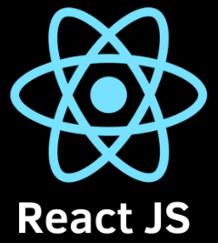

# Hi there, I'm Pardha Saradhi Chodey
Welcome to my world!  
## About Me 
I'm a Software Development Engineer. I love python. Well Versed with Mern Stack and Django. worked on various Aws services like EC2, S3, Amplify, AWS API Gateway, Lambda, etc.   

  
Coding Hours:  

## Skills and Technologies
<h3 align="left">FrontEnd:</h3>

 
  &nbsp;
  &nbsp;
   &nbsp;
&nbsp;
&nbsp;

<h3>Backend:</h3>

&nbsp;
&nbsp;
&nbsp;
&nbsp;
&nbsp;
&nbsp;
&nbsp;
&nbsp;
&nbsp;
&nbsp;

<h3>Databases:</h3>

 
  &nbsp;
  &nbsp;
  &nbsp;
  &nbsp;
  &nbsp;

<h3>Other Important Tools:</h3>

 
  &nbsp;
  &nbsp;
  &nbsp;
  &nbsp;
  &nbsp;

## Featured Projects
- **Civicx**: [Project to showcase my cloud computing Skills](https://github.com/pardhasaradhichodey/Cloud_Computing_Project)
- **Monster Rolodex**: [Project to showcase my react skills](https://github.com/pardhasaradhichodey/monsters-rolodex)

## GitHub Stats

  
  

## Let's Connect
- LinkedIn: [Pardha Saradhi Chodey](https://www.linkedin.com/in/pardhasaradhichodey/)
- LeetCode: [PardhuChodey](https://leetcode.com/PardhuChodey/)
- Email: [pardhasaradhichodey7@gmail.com](mailto:pardhasaradhichodey7@gmail.com)
